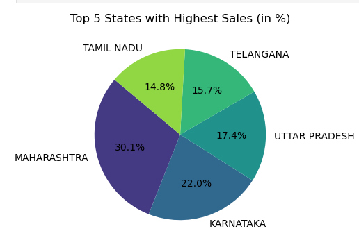
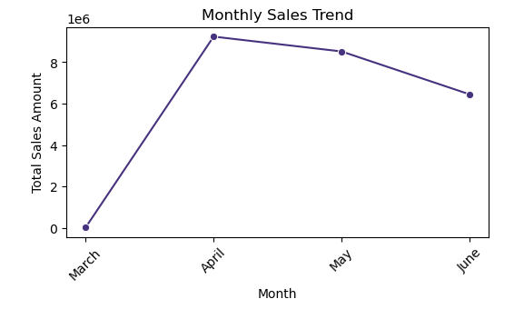
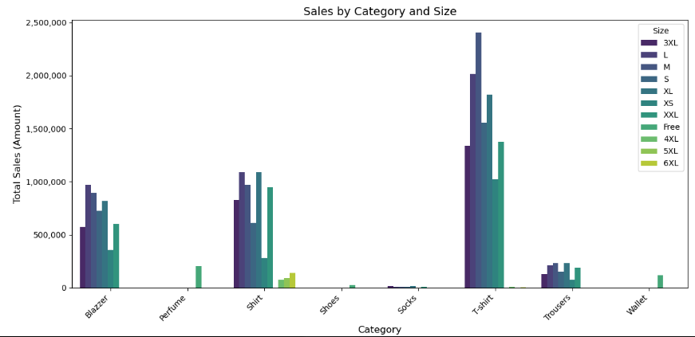

# Sales Data Analysis Using Python
This project involves analyzing a dataset of customer sales for a clothing company, applying advanced data analytics and business intelligence techniques to uncover insights that drive business decision-making. The project highlights how data analysis can solve business challenges such as improving sales performance, identifying top-performing regions and products, reducing cancellations, and optimizing inventory. The goal is not only to explore the data but to propose actionable strategies based on data insights


---

### Introduction
The goal of this analysis is to leverage data analytics to generate business insights that can inform strategic decisions. By identifying trends in sales data, understanding customer preferences, and detecting operational inefficiencies, the analysis aims to help the company improve sales, customer satisfaction, and operational efficiency. The project combines technical data processing with business intelligence to propose strategies for growth and optimization.


### Tools
- Programming Language: Python
- Libraries Used:
- pandas for data manipulation
- numpy for numerical operations
- matplotlib and seaborn for data visualization

Academic Rigor: Applied robust data analysis techniques, including exploratory analysis, trend identification, and correlation analysis.

Practical Impact: Delivered actionable insights for inventory optimization, seasonal marketing, and operational improvements.

**_Python Code; Snippet_**
```
import matplotlib.pyplot as plt
import seaborn as sns
from matplotlib.ticker import FuncFormatter

# Step 1: Group the data by Category and Size and get the sum of Amount
grouped_data = df.groupby(['Category', 'Size'])['Amount'].sum().reset_index()

# Step 2: Plot a grouped bar plot
plt.figure(figsize=(12, 6))
ax = sns.barplot(x='Category', y='Amount', hue='Size', data=grouped_data, palette='viridis')

# Step 3: Format y-axis to display the amount in a readable way (comma-separated, no scientific notation)
formatter = FuncFormatter(lambda x, _: f'{x:,.0f}')
ax.yaxis.set_major_formatter(formatter)

# Adding title and labels
ax.set_title('Sales by Category and Size', fontsize=14)
ax.set_xlabel('Category', fontsize=12)
ax.set_ylabel('Total Sales (Amount)', fontsize=12)

# Display the plot
plt.xticks(rotation=45, ha='right')
plt.tight_layout()
plt.show()
```
_This code creates a grouped bar plot to visualize total sales (Amount) by Category and Size, making it easier to compare sales performance across different categories and sizes with a clear, readable format._

---
### Dataset Overview
The dataset consists of the following fields:

- Order Details: Order ID, Status, Fulfillment, Sales Channel
- Product Details: Category, Size, Qty, Amount
- Shipping Information: ship-city, ship-state, ship-country
- Temporal Details: Month extracted from date fields
- Additional Fields: B2B indicator, courier details, and more

  ### Key Steps and Workflow
##### 1. Data Cleaning
- Checked and removed duplicate records.
- Addressed missing values by excluding or imputing where appropriate.
- Converted Date column to datetime format and extracted the Month column for temporal analysis.
- Ensured the integrity of data by validating categories, numerical values, and order statuses.

##### 2. Exploratory Data Analysis (EDA)
 #### Key Business Questions
1. Revenue Distribution: Which states contribute the most to total revenue, and where is the company losing out?
2. Sales Trends: How do sales vary over time, and which months show the most significant spikes in sales?
3. Product Demand: Which product categories and sizes are most popular, and how should the company adjust inventory based on demand?

#### 3. Correlation Analysis
- The analysis focused on numerical relationships (e.g., between Amount, Qty, and other fields)_
- Amount and Qty showed a strong positive correlation, as expected (0.87), confirming higher quantities lead to higher sales.
- Non-numerical variables such as ship-state and Category were also encoded for potential exploration but were excluded for simplicity.

#### Initial Business Insights
- Top Performing Regions: Maharashtra consistently generates the highest revenue, while states like Arunachal Pradesh show underperformance.
- Seasonality: Sales trends show significant spikes during specific months, indicating seasonal demand and potential opportunities for promotional events.
- Product Preferences: T-shirts and shirts dominate sales across all regions, with Medium and Large sizes being the most popular.

#### Business Insights and Problem Solving
**1. Sales Optimization for Underperforming States**
- **Problem**: Several states, such as Arunachal Pradesh, contribute minimally to overall sales.
- **Insight**: The underperformance of these regions may be due to lower awareness or a mismatch in the product offering.
- **Solution**: A targeted marketing campaign, focusing on product awareness and regional preferences, could help boost sales in these areas.

**2. Maximizing Sales Through Seasonal Trends**
- **Problem:** Sales trends show spikes during certain months, but there are missed opportunities in off-peak months.
- **Insight**: Seasonal trends indicate periods of high demand, but there is also a consistent drop-off in sales outside these months.
- **Solution**: The company could implement strategic sales campaigns during off-peak months, like discount offers or promotions, to balance seasonal fluctuations and maintain steady sales throughout the year.

**3. Inventory Optimization and Demand Forecasting**
- **Problem**: With Medium and Large sizes being the most popular, smaller sizes may be overstocked, leading to unnecessary inventory costs.
- **Insight**: Inventory management needs to be optimized based on size preferences to reduce overstocking and improve sales efficiency.
- **Solution**: Implement a dynamic inventory model that adjusts stock levels for different sizes based on regional preferences, reducing waste and increasing availability of high-demand item.

#### Visualization and Actionable Findings
**1. Revenue by Region (State)**

**Actionable Insight**: A Pie Chart showing the revenue contribution by state reveals that Maharashtra and Karnataka lead in sales, while smaller states like Arunachal Pradesh lag behind.

**Strategic Action**: The company should focus marketing and sales efforts in underperforming regions.



---

**3. Monthly Sales Trends**

**Actionable Insight**: Line graphs illustrate peak sales months, with notable spikes in certain periods.

**Strategic Action**: The company can prepare for these peaks by ramping up production and marketing efforts during high-demand periods.



---

**4. Product Sales Analysis**

**Actionable Insight**: A pie chart of product category sales shows that T-shirts and Shirts are dominant.

**Strategic Action**: Increase production and focus on these top-selling categories, while exploring new offerings for regions with demand for diverse products.



---

#### Further Operational Efficiency:
- Maintain fulfillment excellence while addressing minor inefficiencies in return/cancellation rates.
Limitations
- Lack of customer demographic data restricted personalized analysis.
- Limited external data (e.g., promotional history) hindered deeper causal analysis of sales spikes.


#### Data Source
This dataset was obtained from Kaggle. It provides a comprehensive overview of Amazon sales data.

#### Acknowledgements
Special thanks to the contributors of Python libraries pandas, NumPy, matplotlib, and seaborn.
Special thanks to ChatGPT Gen Ai for providing assistance with structuring and refining the analysis.


### Conclusion
This analysis demonstrates the power of data analytics in transforming business operations. Key insights, including regional sales performance, seasonal trends, and inventory optimization, offer actionable recommendations to improve sales and operational efficiency. By focusing on underperforming regions, aligning inventory with customer demand, and leveraging seasonal trends, the company can drive revenue growth and streamline its processes.

### Future Work
- Predictive Analytics: Build predictive models to forecast sales trends based on past data, helping the company proactively plan for demand fluctuations.
- Customer Segmentation: Implement customer segmentation analysis to create personalized marketing campaigns and optimize product offerings.
- Advanced Dashboarding: Develop an interactive business intelligence dashboard to visualize sales performance in real-time, allowing decision-makers to monitor KPIs and take immediate action.
